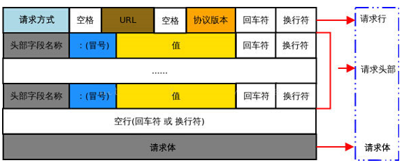
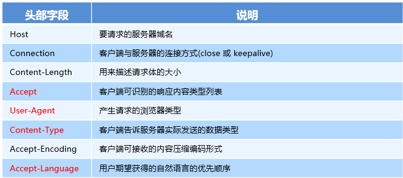
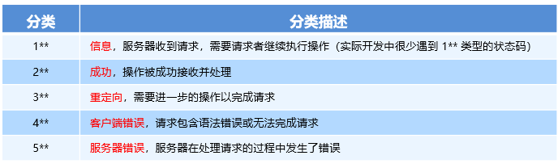
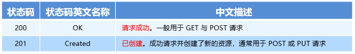
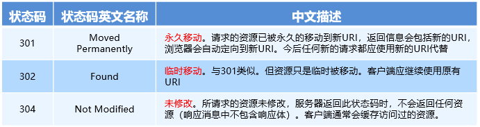
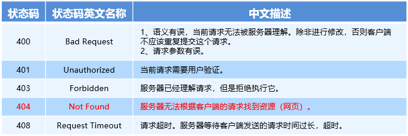
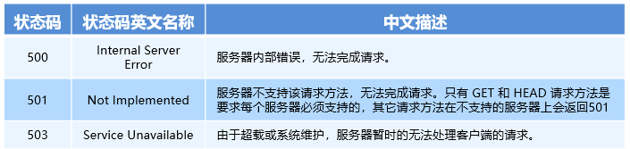
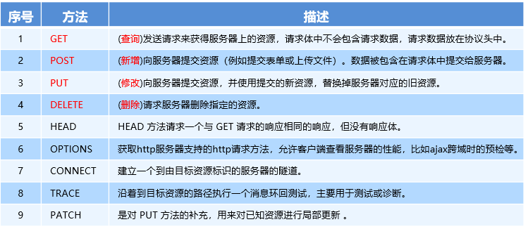

## AJAX学习

### 参考资料

https://www.bilibili.com/video/BV1zs411h74a?p=16&vd_source=88e4bffc33a1ac3ec57e1b3c0320c0bf

### 学习记录（暂时完结）

#### 20220901
- 请求数据：get()获取，post()提交
- jquery中的获取和提交：$.get(url, data, callback),$.post(url, data, callback)
- $.ajax({type:'get, url:'', data:{}, success: function(){}})
- 接口：被请求的URL地址

#### 20220902
- form表单
  - 常见属性：
    - action：URL，向何处发送表单数据，默认提交后立即跳转，并将数据写到?后面
    - target：在何处打开新的URL，_blank（新标签页） | _self（覆盖）
    - method："GET" | "POST"，后者不会再URL中体现数据
    - enctype：编码方式，默认是application/x-www-form-urlencoded：在发送前编码，multipart/form-data：不进行编码。
  - 问题：默认会跳转，原页面数据会丢失
- Ajax提交表单事件
  - jQuery：$('form').on('submit', callback) 或 $('form').submit(callback)提交，提交时可通过$('form').serialize()获取查询字符串
  - DOM：form.onsubmit(callback) 或addEventListener
- 模板引擎art-template
  - 使用方式
    - 引入js库
    - 定义数据对象，data={}
    - 定义模板（script标签，类型为text/html）
    - 根据数据和模板，使用template函数获取html字符串
    - 渲染页面
  - 语法
    - 输入：{{value}}
    - 原文输出：{{@ value}}
    - 条件输出：{{if value}} ... {{else if value}} ... {{\else}}
    - 循环输出：{{each arr}}   `{{$index}} {{$value}}`   {{\each}}
    - 过滤器：{{value | filterName}}，在sjs中使用template.defaults.imports.filter = function (value) {}来定义
  - 原理：正则
    - 1. 使用正则匹配{{name}}
    - 2. 定义数据data = {name:'张三'};
    - 3. 循环替换所有{{name}}为data['name']
- XMLHTTPRequest对象
  - 属性：readyState：0-4
  - Get：创建，open，send，onreadystatechange
  - Post：创建，open，setRequestHeader，send，onreadystatechange
- JSON：js对象/数组的字符串表示法
  - 规定：
    - 字符串要用英文字符串包裹
    - 数据类型纸篓六种：数组、字符串、布尔值、null、数组、对象
    - 不能写注释
  - JSON对象转js对象：JSON.parse
  - js对象转JSON字符串：stringfy
- XMLHTTPRequest Level2
  - 可以设置请求时限：timeout和ontimeout
  - 可以使用formdata对象
  - 可以上传文件，xhr.upload.onprogress上传过程，xhr.upload.onload上传完成
  - ajax上传文件方式，ajaxStart表示开始上传，ajaxStop表示上传完毕，注意只能给document添加事件
- axios：get/post/axios

#### 2022.09.03-04
- 同源策略：浏览器提供的安全功能，协议、域名、端口均相同才会传输
- 跨域：不能正常接收服务器响应
  - JSONP：利用srcipt标签不受同源策略的影响这一特性
  - ?callback表示请求成功的回调函数
  - jQuery中的ajax函数，将dataType设置为‘jspon’
- 防抖：每次点击之后一段时间才会触发；多次点击，只有最后一次生效
- 节流：每次点击后有一段时间内再次点击无效
- HTTP协议
  - 请求消息：
   
    - 常见的请求头
     
    - 请求体只有 POST 有， post没有
  - 响应消息
  - 常见的相应状态码
    
    -  
    -  
    -  
    -  
  - HTTP请求方式
    -    